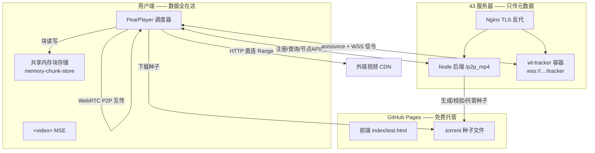
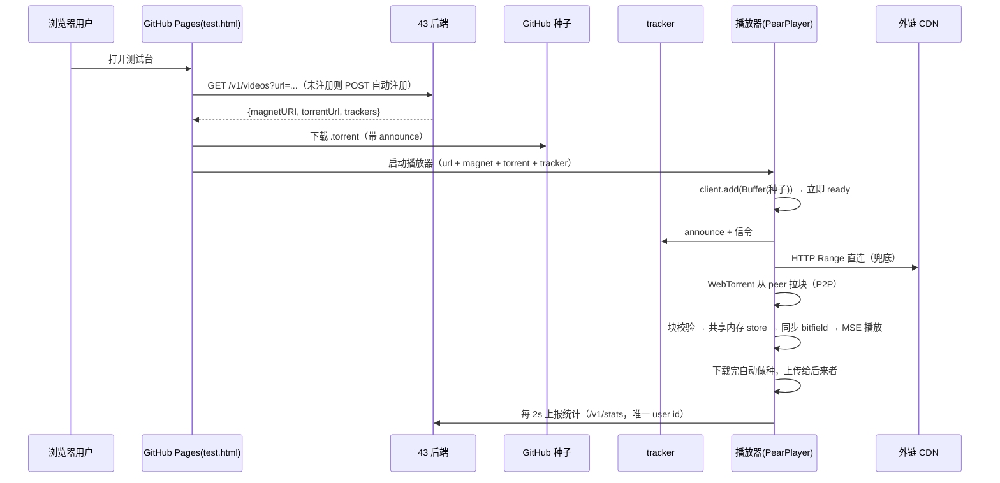

# PearPlayer 外链视频 HTTP + P2P 双通道播放 —— 原理整理

> 本文档是项目原理的权威整理版，**所有内容均基于实际代码与线上实测**（不含猜测）。
> 覆盖：问题与目标 → 架构 → 核心机制 → 端到端数据流 → 部署拓扑 → 安全边界 → 实测数据。
> 整理日期：2026-08-25

---

## 1. 要解决的问题

用户只提供两样东西：

1. **HTTP 外链 URL** —— 视频真实地址（如 CDN：`vodcdn.sg.kaltura.com/.../a.mp4`）
2. **磁力 hash** —— 同一视频在 BT 网上的标识（`magnet:?xt=urn:btih:...`）

目标是：浏览器打开一个播放页即可流畅播放，且满足硬约束：

| 约束 | 含义 |
|:--|:--|
| **服务端零上行** | 视频数据全部在用户端互相分享，服务端只出几 KB 元数据（种子/磁力/注册信息） |
| **用户零干预** | 只给 url + magnet，注册/种子/索引全自动完成 |
| **数据不重复处理** | 以种子（infoHash）为中心建立索引，同一视频只处理一次，重启可恢复 |

核心矛盾：**没有服务端上传，第一个用户、没有 peer 时怎么办？** → 用 **HTTP 直连 CDN 兜底**，P2P 只是加速与分流（实测 P2P 占比 94~97%）。

---

## 2. 总体架构



**分工一句话**：
- **CDN** = 兜底 + 冷启动数据源（永远可用）
- **浏览器** = 下载 + 校验 + 做种（内存缓存，互传）
- **tracker** = 让用户互相发现（peer 发现 + WebRTC 信令）
- **GitHub Pages** = 免费托管前端与种子（零带宽成本）
- **43 后端** = 把「url + magnet」变成「可播的 torrent」+ infoHash 索引 + 统计

---

## 3. 核心机制

### 3.1 以种子为中心（infoHash 索引复用）

服务端维护两个持久化索引（`data/videos.json`，重启自动恢复）：

- `videos` Map：`url → 注册记录`
- `infoHashes` Map：`infoHash → 已处理的种子记录`

注册流程（`video-service.js registerVideo`）：

```
POST /v1/videos {url, magnet?, torrentUrl?}
  ├─ url 已注册？ ───────────────→ 直接返回（幂等）
  ├─ magnet 有 infoHash 且索引里有？ ─→ 复用历史种子处理结果（跳过下载/解析）
  │     └─ 否则 registerWithMagnet（种子获取可靠性排序）：
  │           ① 本地 torrents/ 缓存        → metaSource: local
  │           ② torrentUrl / 磁力 xs= 直链 → 下载+解析+校验 infoHash（GitHub）
  │           ③ 都没有 → downloadmeta      → 从 peer/DHT 交换 metadata（best effort）
  │        校验 infoHash 一致 → saveTorrent 托管 → 注册
  └─ 无 magnet → registerByDownload：服务端下载一次 → 生成种子（最佳方案）
```

**关键点**：同一个 infoHash 无论有多少个 url 镜像，种子只处理一次；重启后从 `videos.json` 恢复，直接跳过种子处理。

### 3.2 双通道下载（HTTP 直连 + WebRTC P2P）

`<video>` 的 src 直接是外链 CDN url（跨域 Range 直连，无媒体代理）。同时 WebTorrent 从 peer 拉块。**调度器**（`dispatcher.js`）用滑动窗口把待下载区间分给多个下载源：

- `HttpDownloader`（type 0/1：server/node）—— Range 请求 CDN
- `RTCDownloader`（type 2）—— 本地 Fog DataChannel（仅本地联调）
- `WebTorrent`（浏览器 P2P）—— 从其他用户拉块

谁的块先到就用谁的，最终拼成完整视频流喂给 MSE。

### 3.3 共享内存块存储与做种（服务端零上行的关键）

```
HTTP/DC 下载块 ──store.put──▶ 共享内存 store（chunks 数组）──store.get──▶ WebTorrent 上传给 peer
                                   │
                                   └──bitfield 同步──▶ 其他下载源知道"这块有了"
```

- 存储 = `ImmediateChunkStore(memory-chunk-store)`，**纯内存数组**（浏览器无文件系统权限）
- HTTP 下载的块也会 `torrent.bitfield.set(index, true)` **同步给 WebTorrent** → WebTorrent 就能把这块做种上传
- 反过来 WebTorrent 从 peer 下的块进同一 store → MSE 可播
- 下载完成后浏览器自动变成 seeder，为后来者上传（实测上传速度正常）

### 3.4 块校验（防投毒）

`piece-validator.js` 用种子里的 **192 个 SHA1 哈希**（512KB/块）校验每个下载块，`Rusha.sha1(data).hex === pieces[index]`，失败丢弃重下，防止恶意 peer 投毒。

### 3.5 tracker 与信令

- **tracker 职责**：peer 发现 + WebRTC 信令（WebTorrent 的 wss 协议里同时交换 SDP）
- **种子自带 announce**（`wss://bot3.1230sb.com/tracker`）→ WebTorrent 读取种子文件自动连接（播放器日志显示 `🔗 tracker 连接: ...`）
- **前端补充 trackers** 与种子 announce 合并去重
- 自建 tracker 是**稳定性补充**（peer 需连同一 tracker 才能互见；公共 tracker 不稳定）
- 验证方法注意：wt-tracker 是纯 WS 服务器，**curl GET 会 404**，必须用 WSS 握手验证

### 3.6 外链 host 反查（直连 CDN 场景）

播放器 `video.src` 是外链 CDN，节点 API 用 `host=外链域名&uri=外链路径` 请求 → 后端 `getVideoByExternalHost` 反查注册记录 → 返回 size + magnet，让 HTTP 直连与 P2P 同时工作。

---

## 4. 端到端数据流（一个用户打开播放页）



---

## 5. 部署拓扑

### 本地联调
```
127.0.0.1:8000  Node 后端（HTTP + 播放页）
127.0.0.1:8001  WS 信令（本地 Fog/DataChannel）
启动: server 目录 PEAR_FOG_COUNT=0 node index.js
```

### 外网生产
```
前端  https://wietrade.github.io/p2p_mp4/   ← GitHub Pages（deploy/p2p_mp4 仓库）
后端  https://bot3.1230sb.com/p2p_mp4/     ← nginx 反代 127.0.0.1:8000（Node）
tracker wss://bot3.1230sb.com/tracker      ← nginx 反代 127.0.0.1:8083（wt-tracker docker）
种子  https://wietrade.github.io/p2p_mp4/torrents/*.torrent（GitHub）
```

43 后端启动环境变量：
```
PEAR_FOG_COUNT=0  PEAR_NO_NODES=1  PEAR_WS_PORT=8003
PEAR_PUBLIC_BASE=https://bot3.1230sb.com/p2p_mp4
PEAR_TORRENT_BASE=https://wietrade.github.io/p2p_mp4/torrents
PEAR_SOURCE_HOST=bot3.1230sb.com  PEAR_SOURCE_PORT=443
```

前端页面**按 hostname 自适应**：`127.0.0.1/localhost` → 本地后端 + 开 DataChannel；外网 → 默认公网后端 + 关 DataChannel（P2P 走 WebTorrent wss 信令，不连本机 WS）。

---

## 6. 安全与边界（2026-08-25 已修复）

| 项 | 问题 | 修复 |
|:--|:--|:--|
| SSRF | 开放注册 + `/proxy/{id}` 可探测内网/云 metadata | 注册校验内网（`isPrivateHost`）+ 转发前二次校验 |
| HTTP 状态码 | `http-downloader` 判断恒真（`\|\|`） | 改为 `&&` + Content-Range 空保护 |
| 路径穿越 | 种子 `parsed.name` 写文件 | `sanitize` 去 `..` |
| 磁盘打满 | 最佳方案无大小限制下载 | `maxDownloadBytes` 上限（默认 2GB） |
| 末块边界 | 文件大小为 pieceLength 整数倍时末块 range 错误 | `_calRange` 整除分支 |
| 外网信令 | `signalWsUrl` 硬编码 127.0.0.1:8001 | 外网 `useDataChannel=false` |
| 统计桩 | reporter 死代码 + axios 进 bundle | 清理为 noop 桩 |

---

## 7. 实测数据（线上验证）

| 指标 | 值 |
|:--|:--|
| P2P 占比 | 94.7% ~ 97.4%（kaltura 100MB/192 块） |
| HTTP 回源 | 仅兜底缺口（8/192 块） |
| tracker | WSS 握手正常（curl GET 404 为预期） |
| 做种 | 上传速度正常（用户间互传） |
| 注册复用 | 同 infoHash 多 url 只处理一次，重启恢复 |
| 前端自适应 | 本地/外网同一份页面按 hostname 切换 |

---

## 8. 关键文件索引

| 文件 | 职责 |
|:--|:--|
| `server/index.js` | 入口：全部路由 + WS 8003 + 统计 |
| `server/video-service.js` | 注册/种子获取/索引复用/SSRF 校验 |
| `server/config.js` | 端口/媒体/tracker/节点/上限配置 |
| `server/nodes-api.js` | 节点 API（PearPlayer 协议） |
| `server/http-media.js` | 媒体服务 + 回源代理 |
| `server/gen-torrent.js` | 生成带 announce 的种子 |
| `src/worker.js` | WebTorrent 集成 + trackerinfo + uploadspeed |
| `src/dispatcher.js` | 多源调度 + 块存储 + bitfield 同步 |
| `src/http-downloader.js` | HTTP Range 下载 |
| `src/piece-validator.js` | 块 SHA1 校验 |
| `src/reporter.js` | 统计桩（走后端 /v1/stats） |
| `scripts/deploy.js` | 同步部署包到 deploy/p2p_mp4 |
| `deploy/p2p_mp4/` | GitHub Pages 部署包（独立仓库 wietrade/p2p_mp4） |

---

## 9. 最终架构定型（精简且健壮）

经过多轮验证、修复与精简，最终方案收敛如下（**不再需要 Node 数据桥或用户贡献节点**）：

| 组件 | 定型 |
|:--|:--|
| 浏览器 P2P | WebTorrent（WebRTC），仅用户间互传，内存做种（关闭即停） |
| HTTP 兜底 | 直连外链 CDN（Range），冷启动/无 peer 兜底 |
| tracker | `wss://` 自建 + openwebtorrent 并行（用户间发现）；种子另带 `udp://` `http://` 公共 tracker 兼容 uTorrent |
| 种子 | 标准 .torrent，7 个 announce，infoHash 与 piece 哈希稳定 |
| 服务端 | **零上行**：注册 + infoHash 索引 + 种子托管 + tracker + 统计 + `rtc_config` + `health` |
| 前端 | GitHub Pages，hostname 自适应（本地/外网），rtcConfig 动态下发，trackers 始终合并 |
| WebRTC | 多 STUN（google/twilio/cloudflare）+ 可选 TURN（`PEAR_TURN_*`） |

**已移除/降级**：
- Node 数据桥（方案 B）——服务器流量不可承受
- 用户贡献节点（方案 C）——用户无法运行 Node 程序
- Fog DataChannel / 信令 WS——仅本地联调（外网 `useDataChannel=false`）
- 测试残留（`node-seed.js`、`p2p-server.tgz`、deploy 测试 json/torrent/conf）

**健壮性**：
- `/health` 健康检查（`https://bot3.1230sb.com/p2p_mp4/health`）
- `server/start-43.sh` 启动脚本固化（含全部环境变量）
- 进程守护建议（43）：systemd unit 或 pm2（`Restart=always`），日志 `/tmp/p2p-server.log`
- 7 项安全/边界修复（SSRF、状态码、路径穿越、下载上限、末块边界、外网信令、reporter 清理）
- 多 tracker 并行 + 多 STUN：单个 tracker/STUN 故障不影响 P2P（实测 btorrent.xyz 故障被兜住）
