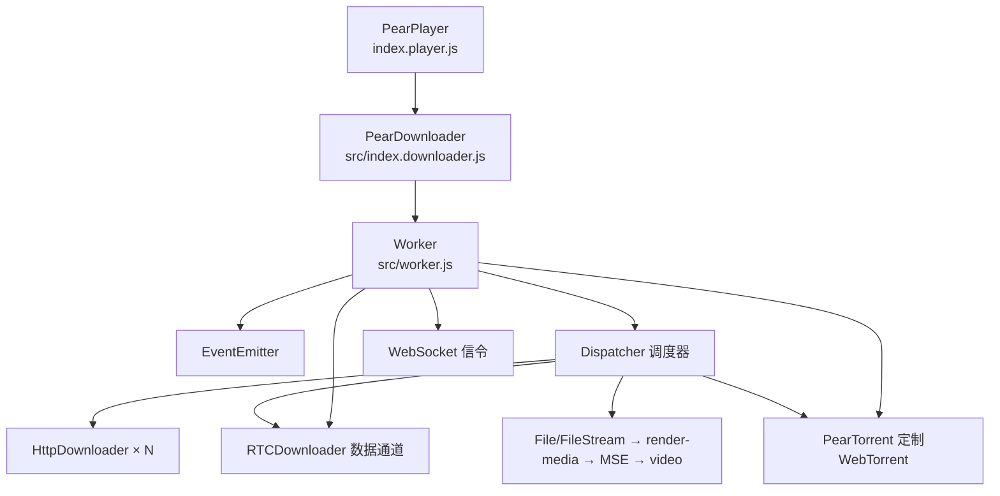
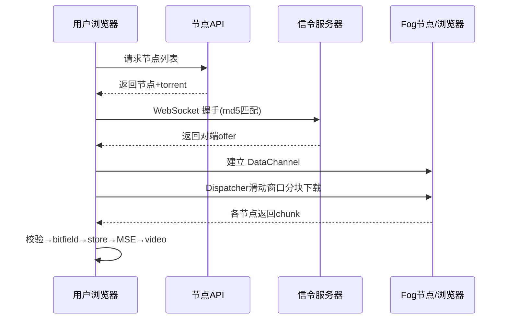

# PearPlayer.js 研究与本地后端联调总结

> 本文档完整记录了对 [PearInc/PearPlayer.js](https://github.com/PearInc/PearPlayer.js) 的源码研究、
> 自建后端、以及浏览器联调验证的全过程。所有结论均基于源码事实与实测数据，不含猜测。
> 日期：2026-08-24 ~ 2026-08-25

---

## 目录

1. [项目概述](#1-项目概述)
2. [项目原理分析](#2-项目原理分析)
3. [后端组件设计](#3-后端组件设计)
4. [协议细节（实测确认）](#4-协议细节实测确认)
5. [播放器源码修复（5 个 bug）](#5-播放器源码修复5-个-bug)
6. [43 服务器部署（CDN + tracker）](#6-43-服务器部署cdn--tracker)
7. [联调验证结果](#7-联调验证结果)
8. [运行指南](#8-运行指南)
9. [遗留事项](#9-遗留事项)
10. [附录：验证脚本](#10-附录验证脚本)

---

## 1. 项目概述

**PearPlayer（梨享播放器）** 是一个基于 WebRTC 的多协议、多源混合 P2P-CDN 浏览器流媒体播放器（v2.5.10，MIT 协议）。

核心思路：用 **MSE（Media Source Extension）** 把来自多个源节点（HTTP 服务器、Fog 节点、WebRTC DataChannel、其他浏览器）的 Buffer 分块喂给 `<video>`，配合调度算法在保证流畅播放的前提下最大化 P2P 率。

- 仓库：https://github.com/PearInc/PearPlayer.js（2018 年后基本停止维护）
- 构建：Browserify（`npm run build-player`）
- 依赖：webtorrent@0.98、axios@0.17、node-datachannel（后端）、bittorrent-tracker 等

### 三种下载源

| 下载源 | 类型 | 状态（实测） |
|:---|:---|:---|
| `HTTP_Node` / `HTTP_Server` | HTTP 多源 CDN（Range 请求） | ✅ 验证通过 |
| `WebRTC_Node` | Fog 节点（服务端 DataChannel） | ✅ 验证通过 |
| `WebRTC_Browser` | 浏览器间 P2P（WebTorrent） | ✅ 验证通过 |

---

## 2. 项目原理分析

### 2.1 继承链与核心模块



| 模块 | 职责 |
|:---|:---|
| `index.player.js` | 入口：绑定 video、监听 `canplay`/`loadedmetadata`（按码率自适应窗口） |
| `src/worker.js` | 总控：节点获取、WebSocket 信令握手、启动播放、DataChannel 管理 |
| `src/dispatcher.js` | 调度器：分块、bitfield 记录、滑动窗口分配下载任务、哈希校验、流量统计 |
| `src/http-downloader.js` | HTTP 下载器：XHR + Range，type 0=server / 1=node |
| `src/webrtc-downloader-bin.js` | WebRTC DataChannel 下载器（type=2），256 字节 JSON 头 + 32KB 块 |
| `src/simple-RTC.js` | WebRTC 封装（基于标准 WebRTC API） |
| `src/node-filter.js` | HEAD 请求测试节点连通性，按响应时间排序 |
| `src/node-scheduler.js` | 调度算法：IdleFirst / WebRTCFirst / CloudFirst |
| `src/pear-torrent.js` + `src/lib/*` | 定制 WebTorrent（浏览器间 P2P） |
| `src/file.js` + `file-stream.js` | File 抽象 + 可读流，对接 render-media → MSE |
| `src/piece-validator.js` | 分片 SHA-1 校验（基于 torrent 文件） |
| `src/reporter.js` | 流量/能力上报 |

### 2.2 数据流（一次完整播放）

1. **Worker 启动** → `_getNodes()` 请求节点发现 API（或用户指定 `sources`）
2. **节点筛选**：`nodeFilter` 用 HEAD 请求测速，可用节点按响应时间排序
3. **P2P 握手**（并行）：WebSocket 连接信令服务器，交换 SDP/ICE 建立 DataChannel
4. **调度下载**：`Dispatcher._init()` 按 chunk（512KB）分块 → 滑动窗口并发分配
5. **投喂播放**：每块完成 → `bitfield` 置位 → `store.put` → `FileStream` → `render-media` → MSE → `<video>`



### 2.3 调度算法

- **两种下载算法**：`pull`（player 强制默认，滑动窗口按码率自适应 3~15）和 `push`（固定 `maxLoaders` 并发）
- **节点优先级**：优先"空闲"且"速度快"的节点；窗口内过滤 server（type 0）鼓励 P2P
- **容错**：节点出错即移除并补充；下载器不足时请求更多节点/数据通道/兜底源
- **异常降级**：任何环节失败 → `fallback` 事件

---

## 3. 后端组件设计

本地后端位于 `server/` 目录（纯 Node，零框架依赖 + `ws` + `node-datachannel`）：

```
server/
  index.js          入口：HTTP + WS 信令 + Fog 节点
  config.js         端口/媒体目录/节点列表/torrent pieceLength/Fog 数量/magnetURI
  media.js          媒体路径解析（/host:port/xxx → mediaRoot/xxx）
  http-media.js     HTTP 媒体服务（HEAD/Range/CORS，可选延迟/限速）
  nodes-api.js      节点发现 API /v1/customer/nodes
  torrent-service.js create-torrent 生成（512KB piece）
  signaling.js      WebSocket 信令（offer 注册/分发、answer/candidate 转发）
  fog-node.js       WebRTC DataChannel 文件服务（node-datachannel）
  public/
    index.html      播放器联调页
    seed.html       WebTorrent seed 页面（浏览器做种）
    webtorrent.min.js 本地构建的 webtorrent bundle
  media/            媒体文件（demo.mp4 / bbb.mp4）
  torrents/         生成的 torrent 文件
```

---

## 4. 协议细节（实测确认）

### 4.1 节点发现 API

```
GET /v1/customer/nodes?host={视频host}&uri={视频path}
Header: X-Pear-Token: {token}
```

响应 JSON：
```json
{
  "size": <文件字节数>,
  "torrents": { "512": "<torrent 下载 URL>" },
  "nodes": [
    { "protocol": "http", "http_port": n, "https_port": n, "host": "x", "type": "node", "capacity": n },
    { "protocol": "webtorrent", "magnet_uri": "magnet:?xt=urn:btih:..." }
  ]
}
```

- 客户端用 `size>0` 判断成功；下载 `torrents["512"]` 构建 PieceValidator
- http 节点最终 uri = `{protocol}://{host}:{port}/{视频host}{视频path}`（**带 host 前缀**，需 nginx rewrite）

### 4.2 HTTP 节点服务

- 支持 **HEAD**（node-filter 测速，2xx + Content-Length）
- 支持 **GET + Range**（http-downloader：`Range: bytes=begin-end`，响应 206 + Content-Range）
- 需要 **CORS**（`Access-Control-Allow-Origin: *`，暴露 Content-Range 等头）

### 4.3 torrent 服务

- 用 `create-torrent` 生成，**pieceLength 必须等于播放器 chunkSize（512KB）**，否则分片校验错位
- `parse-torrent-file` 解析后 `pieces` 是 **40 字符 hex 字符串数组**（实测确认），与 `Rusha` 的 hex 输出直接比较
- 播放器校验：`Rusha.sha1(chunk).hex === pieces[index]`，`index = floor(start/pieceLength)`

### 4.4 WebSocket 信令

```
浏览器 → 服务器: {"action":"get","peer_id","host","uri","md5"}  (md5 = md5(host+uri))
服务器 → 浏览器: {"nodes":[{"peer_id","offer_id","sdp":{type,sdp},"errorcode"}]}
服务器 → 浏览器: {"action":"candidate","peer_id","candidates":{"type":"end"}}   ← 触发 addIceCandidate
浏览器 → 服务器: {"peer_id","to_peer_id","offer_id","action":"answer","sdps":{...}}
浏览器 → 服务器: {"peer_id","to_peer_id","offer_id","action":"candidate","candidates":{...}}
```

- **关键**：offer SDP 必须含 `a=candidate` 行（浏览器 `makeCandidateArr` 从 SDP 提取候选，并剥掉后 setRemoteDescription）
- 浏览器只处理 `candidates.type==='end'` 的候选消息，非 trickle

### 4.5 Fog 节点（服务端 DataChannel）

- 服务端是 **WebRTC initiator**（创建 DataChannel → 自动协商出 offer）
- 浏览器请求：`{host, uri, action:"get", response_type:"binary", start, end}`（JSON 字符串）
- 响应协议：每块 = **[256 字节扁平 JSON 头] + [32KB 数据]**
  - 首块头 `{begin:true,start,end}`（无数据，触发客户端清空缓冲）
  - 数据块头 `{value:true,start,end}`（start/end 为该块文件字节范围）
  - 末块头 `{done:true,start,end}`（无数据，触发拼接提交）
  - **头必须是扁平 JSON**（不能嵌套对象，否则客户端 `split('}')[0]` 截断）
- 心跳：客户端每 90s 发 `{action:"ping"}`，服务端忽略
- 客户端校验 `retBuf.length === (end-start+1)` 才提交数据

### 4.6 WebTorrent 浏览器 P2P

- 播放器 `useTorrent && magnetURI` 时创建 PearTorrent，`store/bitfield` 与 Dispatcher **共享**
- `announce` 走 WSS tracker；`strategy: 'rarest'`
- 下载的 piece 通过 `piecefromtorrent` 事件进入 Dispatcher 统计（`sourcemap='b'`、`traffic WebRTC_Browser`）

---

## 5. 播放器源码修复（5 个 bug）

联调过程中发现并修复了 **5 个播放器源码 bug**，均为最小改动：

| # | 文件 | 问题 | 修复 |
|:---:|:---|:---|:---|
| 1 | `src/simple-RTC.js` | `ondatachannel` 里用 `this.dataChannel`（`this` 是 peerConnection）→ 抛异常导致 `dataChannelEvents` 不绑定，DC 消息丢失 | 改为 `self.dataChannel` |
| 2 | `src/worker.js` | `makeCandidateArr` 硬编码 `sdpMid:"data"`，与 SDP 的 `a=mid:0` 不匹配 → 6 次 `addIceCandidate` 报错 | 从 SDP 提取真实 `a=mid` |
| 3 | `index.player.js` | `loadedmetadata` 里 `else if (self._windowLength > 15)` 误用未定义属性 → 高码率视频 `windowLength` 不被限制（可达 92）→ `addTorrent` 判断窗口越界 → `torrent.select` 不执行 → WebTorrent 空转不下数据 | 改为 `windowLength > 15` |
| 4 | `src/worker.js` + `src/reporter.js` | 后端地址硬编码到已下线的 `webrtc.win` | 支持 `window.PearConfig` 运行时覆盖（须在加载 `pear-player.js` 前设置） |
| 5 | `src/dispatcher.js` | `addTorrent` 只 `select` 窗口外 piece（`windowOffset+windowLength..末尾`），窗口内全靠 HTTP/Fog → 慢 CDN 时开头数据迟迟不到，播放卡顿转圈 | 改为 `torrent.select(0, pieces.length-1)`（store/bitfield 共享自动去重，P2P 可补窗口内） |

> 补充：`src/worker.js` 中 PearTorrent 实例化处还修复了 **webtorrent 0.98 默认 STUN 无效** 的问题——必须用 `tracker.rtcConfig` 覆盖（`opts.rtcConfig` 是 deprecated 兼容写法，实际不生效）。

---

## 6. 43 服务器部署（CDN + tracker）

### 6.1 服务器现状

- 服务器：`43.165.167.132`（SSH: root，密钥 `I:\1H\43.165.167.132_id_ed25519`）
- 宝塔面板，网站根目录：`/www/wwwroot/bot3.1230sb.com/`
- **wt-tracker 容器**（bittorrent-tracker）运行中：监听 `127.0.0.1:8083`
- **nginx (443 TLS)** 反代：`wss://bot3.1230sb.com/tracker` → `127.0.0.1:8083`
- **80 端口开放**（http 静态服务），用于匹配本地页面的 http 协议

### 6.2 新增配置

**媒体文件**：`/www/wwwroot/bot3.1230sb.com/bbb.mp4`（30MB，Big Buck Bunny，CC-BY 开源测试片）

**nginx 扩展配置**（`/www/server/panel/vhost/nginx/extension/bot3.1230sb.com/pear.conf`）：
```nginx
# 节点 uri 前缀路径 /bot3.1230sb.com/xxx -> 网站根/xxx + CORS
location ~ ^/bot3\.1230sb\.com/(?<mediafile>.*)$ {
    add_header Access-Control-Allow-Origin * always;
    add_header Access-Control-Allow-Methods "GET, HEAD, OPTIONS" always;
    add_header Access-Control-Allow-Headers "Range, Content-Type, X-Pear-Token" always;
    add_header Access-Control-Expose-Headers "Content-Length, Content-Range, Accept-Ranges, Content-Type" always;
    add_header Access-Control-Max-Age 600 always;
    root /www/wwwroot/bot3.1230sb.com;
    try_files /$mediafile =404;
}
# 直接路径（video.src 兜底 server 源也走 XHR）
location ~ \.(mp4|webm|m4v|mov|mp3|m4a|aac)$ {
    add_header Access-Control-Allow-Origin * always;
    add_header Access-Control-Allow-Methods "GET, HEAD, OPTIONS" always;
    add_header Access-Control-Allow-Headers "Range, Content-Type, X-Pear-Token" always;
    add_header Access-Control-Expose-Headers "Content-Length, Content-Range, Accept-Ranges, Content-Type" always;
    add_header Access-Control-Max-Age 600 always;
}
```

### 6.3 测试磁力

```
magnet:?xt=urn:btih:99b2abd7b2ac02270b20b8c3f3634dea77db497e&dn=bbb.mp4&tr=wss%3A%2F%2Fbot3.1230sb.com%2Ftracker
```

- infoHash：`99b2abd7b2ac02270b20b8c3f3634dea77db497e`
- 62 pieces（512KB），30MB

---

## 7. 联调验证结果

### 7.1 HTTP 多源模式 ✅

节点 API → torrent → Range 分块 → SHA-1 校验 → 拼接，**9 块（demo.mp4）全部校验通过**，MSE 正常播放。

### 7.2 Fog 节点（WebRTC DataChannel）✅

- 两个 Fog 节点 DC 打开，`WebRTC_Node` 流量进入 Dispatcher
- `sourcemap='d'` 标记，fog speed 最高 70K KB/s
- Fog 数据包协议通过复刻播放器 `_receive` 逻辑的协议测试（`server/test-fog-packets.js`）

### 7.3 WebTorrent 浏览器 P2P ✅

- seed 页面（本地浏览器）做种 → 43 tracker 分发 → 播放器连上 seed → `WebRTC_Browser` 流量
- 关键实测：修复 #3 前 WebTorrent 空转（`torrent.select` 不执行）；修复后正常抢跑

### 7.4 慢 CDN + P2P 抢跑（真实场景）✅

- 媒体在 43 服务器（远程，1.5MB/s 上传、HTTP 30-60s/块）
- seed 在本地（WebRTC 直连，快）
- 修复 #5 后：**下载从 210 秒 → 7 秒**，视频完整缓冲（`buffered=0.1~10.1`）可流畅播放
- 日志示例：
  ```
  [pear-d] addTorrent pieces=62 chunks=62 windowOffset=4 windowLength=15
  [23:59:31] traffic type=WebRTC_Browser mac=Webtorrent 512.0KB
  [23:59:34] progress 100%
  ```

---

## 8. 运行指南

### 8.1 启动本地后端

```bash
# 默认配置（HTTP 8000 + WS 信令 8001 + Fog 2 节点）
node I:\pearplayer\server\index.js

# 可选环境变量
# PEAR_NODE_HOST / PEAR_NODE_PORT  → 节点指向（如 43 服务器 bot3.1230sb.com:80）
# PEAR_FOG_COUNT                    → Fog 节点数（0 禁用）
# PEAR_HTTP_DELAY_MS                → HTTP 媒体响应延迟（模拟慢 CDN）
```

### 8.2 浏览器访问

- 播放器页面：`http://127.0.0.1:8000/`
- seed 页面：`http://127.0.0.1:8000/seed.html`（做种，须保持前台避免节流）
- 媒体文件放 `server/media/`（URL 路径 = 文件名，无 `/media` 前缀）

### 8.3 播放器配置

`window.PearConfig` 必须在加载 `pear-player.js` **之前**设置：
```js
window.PearConfig = {
  getNodesUrl: 'http://127.0.0.1:8000/v1/customer/nodes',
  signalWsUrl: 'ws://127.0.0.1:8001/wss',
  statdUrl: 'http://127.0.0.1:8000'
};
```

播放器 opts 需传 tracker：
```js
new PearPlayer('#video', {
  useTorrent: true,
  trackers: ['wss://bot3.1230sb.com/tracker'],
  // ...
});
```

### 8.4 重新构建播放器

```bash
npm run build-player    # 修改 src/ 后需重新构建 dist/pear-player.js
```

---

## 9. 遗留事项

- **浏览器间 P2P 稳定性**：seed 页面在后台 tab 会被浏览器节流（30s re-announce 暂停 → 超 tracker LRU 20 分钟被移除），需保持前台或改用 Node 端 seed（webtorrent-cli + wrtc）
- **多客户端联调**：信令已支持多 peer 房间，但仅验证了单 seed + 单播放器
- **Node 端 WebRTC seed**：可进一步在 43 服务器部署 webtorrent-cli + @roamhq/wrtc 做常驻 seed，替代浏览器做种
- **安全加固**：本地后端无鉴权，仅限内网/本机联调使用

---

## 10. 附录：验证脚本

> ⚠️ 下表所列脚本为研究期产物，多数已随项目清理删除（保留记录供参考）。仍在仓库中的仅 `server/gen-torrent.js`。

| 脚本 | 用途 |
|:---|:---|
| `scripts/verify-torrent.js` | 实测 parse-torrent-file 的 pieces 形态 + validator 校验行为 |
| `scripts/verify-protocol.js` | HTTP 闭环：节点 API → torrent → Range → SHA-1 → 拼接 |
| `scripts/test-tracker.js` | 验证 43 tracker wss 可达性（Node 端需 WebRTC 支持才通过 announce） |
| `server/test-fog.js` | 单 Fog 节点注册诊断 |
| `server/test-fog-packets.js` | Fog 数据包协议验证（复刻播放器 _receive 逻辑） |
| `server/webrtc-poc.js` | node-datachannel 本地互连实验 |
| `server/test-signaling.js` | 信令服务器 offer 分发测试 |
| `server/test-tracker-p2p.js` | tracker 双客户端 peer 分发测试（WS JSON 协议） |
| `server/gen-torrent.js` | 生成测试视频的 torrent + magnetURI（参数化：`node gen-torrent.js bbb.mp4`） |

---

*本文档基于 PearPlayer.js v2.5.10 源码与本地/43 服务器实测结果整理。*
