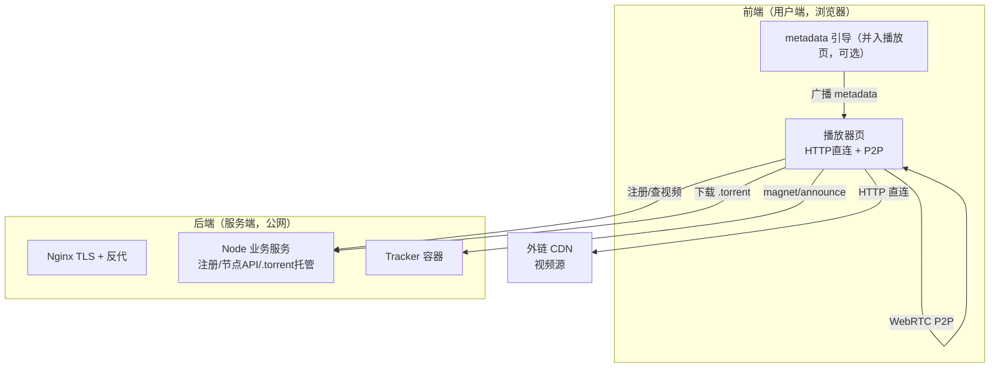
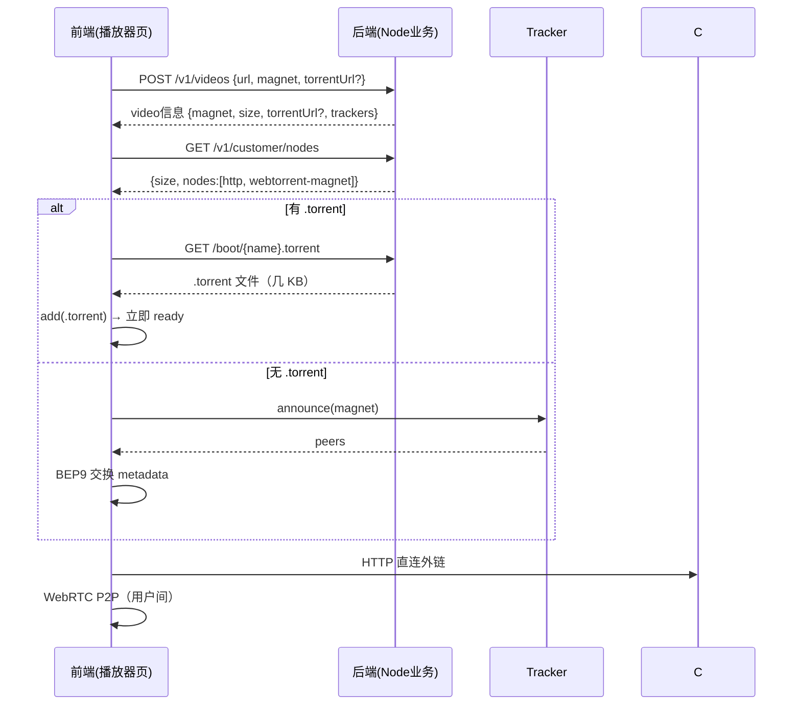

# 外链视频 Web 端 HTTP + P2P 方案（前端 / 后端）

> 目标：用户提供外链视频（HTTP 链接）+ 磁力链接，浏览器用户通过 **HTTP + P2P** 双通道播放。
> 所有内容基于实际搭建与浏览器实测验证。文档按 **前端（用户端）/ 后端（服务端）** 划分。

---

## 0. 前提约束

| # | 约束 | 影响 |
|:--|:--|:--|
| ① | HTTP 视频地址可跨域访问（CORS + Range） | 前端浏览器直连外链，**无需媒体代理** |
| ② | 磁力链接可靠提供（每个视频必有） | 磁力是 P2P 的固定入口 |
| ③ | .torrent / xs 下载链接：可能有可能没有 | 决定 metadata 获取路径（后端提供与否） |

---

## 1. 架构总览



---

# 2. 后端（服务端）

## 2.1 职责
- 注册视频（HTTP 地址 + 磁力）
- 提供 magnet / 节点 API / size
- **决定并托管 .torrent**（有则提供，没有则前端靠磁力 + 引导）
- tracker 协调（peer 发现）

## 2.2 部署清单

| 部署项 | 形态 | 必须 | 数据量 |
|:--|:--|:--:|:--|
| Nginx | TLS 终结 + 反向代理 | ✅ | — |
| Node 业务服务 | 一个进程 | ✅ | KB 级 |
| Tracker | wt-tracker 容器 | ✅ | 几 KB |

## 2.3 API 路由

| 路由 | 作用 | 必须 |
|:--|:--|:--:|
| `POST /v1/videos` | 注册 `{url, magnet?, torrentUrl?, name?}`，HEAD 拿 size，返回 magnetURI/torrentUrl/trackers | ✅ |
| `GET /v1/videos?url=` / `GET /v1/videos` | 按 url 查询 / 列出全部 | ✅ |
| `GET /v1/customer/nodes` | 节点 API（返回 magnet/size，PearPlayer 协议） | ✅ |
| `GET /boot/{name}.torrent` | 托管 .torrent（有则提供） | ⚠️ 有 .torrent 时 |
| `GET /` `/test.html` | 播放页 / 功能测试台 | ✅ |

## 2.4 后端文件结构（目录树 + 清单）

```
pearplayer/
├─ server/                        # ← 后端（Node 服务）
│  ├─ index.js                    # 入口：HTTP 8000 + WS 8001 + 全部路由
│  ├─ config.js                   # 端口 / 媒体 / tracker / 节点 / PEAR_* 配置
│  ├─ video-service.js            # 视频注册（url+magnet）、HEAD 拿 size、.torrent 托管
│  ├─ nodes-api.js                # 节点 API（PearPlayer 协议：magnet/size）
│  ├─ http-media.js               # 媒体服务 + 回源代理 proxyRequest
│  ├─ torrent-service.js          # torrent 生成与缓存（有母本时）
│  ├─ gen-torrent.js              # 命令行生成 .torrent + magnet
│  ├─ signaling.js / fog-node.js  # Fog 信令（次级方案不需要）
│  ├─ metadata-node.js            # Node metadata 引导（Node↔浏览器有坑，推荐浏览器引导）
│  ├─ nginx-pear.conf             # 生产 nginx 反代示例（TLS + /tracker）
│  ├─ media/                      # 本地母本（可选，无则纯用户端）
│  ├─ torrents/                   # 托管的 .torrent（/boot/ 提供）
│  ├─ public/                     # 播放器静态页（见前端树）
│  └─ node_modules/               # wrtc / node-datachannel 等（Node 端 WebRTC）
├─ dist/pear-player.js            # 播放器构建产物（bundle）
├─ src/                           # 播放器源码（见前端树）
├─ index.player.js                # 播放器入口
├─ docs/                          # 方案文档（web-p2p-solution / research-summary）
```

| 文件 | 作用 |
|:--|:--|
| `server/index.js` | 入口：HTTP + WS + 路由（/v1/videos、/boot/、/v1/stats、静态页） |
| `server/config.js` | 端口/媒体目录/节点/tracker 配置 |
| `server/video-service.js` | 视频注册（url + magnet，不下载）、HEAD 拿 size、.torrent 托管 |
| `server/nodes-api.js` | 节点 API（按视频返回对应 magnet） |
| `server/torrent-service.js` | torrent 生成与缓存（有母本时） |
| `server/http-media.js` | 媒体服务 + 回源代理（预留） |
| `server/signaling.js` / `fog-node.js` | Fog 信令（次级方案不需要） |
| `server/metadata-node.js` | Node metadata 引导（**Node↔浏览器交换有坑，推荐浏览器引导**） |
| `server/gen-torrent.js` | 生成 .torrent + magnet（有母本时） |
| `server/torrents/*.torrent` | 托管的种子文件 |

## 2.5 metadata 提供（后端职责核心）

| 场景 | 后端动作 |
|:--|:--|
| 有 .torrent / xs | 下载/托管到 `/boot/` → 前端直接拿（★★★★★） |
| 无 .torrent | 只提供 magnet → 前端靠引导/交换（★★★） |
| 可选增强 | 收磁力时用 `webtorrent downloadmeta` 自动获取 .torrent 并托管 |

---

# 3. 前端（用户端）

## 3.1 职责
- 用户打开**一个播放页**（`/?url=外链&magnet=磁力`）
- HTTP 直连外链 + P2P 双通道播放
- 自动处理"有 .torrent / 无 .torrent"两种情况
- 下载完自动做种（bitfield 同步）

## 3.2 播放器流程

```
播放页内部：
  video.src = 外链（跨域直连）          → HTTP 通道
  WebTorrent：
    ├─ 有 .torrent → add(.torrent) 立即 ready
    └─ 仅 magnet  → add(magnet) + peer 交换 metadata
  → P2P 通道
  → 下载完自动做种
```

## 3.3 前端文件结构（目录树 + 清单）

```
server/public/                    # ← 播放器静态资源（由后端托管）
├─ index.html                     # 播放页：统计面板 + ?url=&magnet=&torrent=&tracker= 自动注册/播放
├─ test.html                      # 功能测试台：注册 / 引导来源 / 节点 API / iframe 播放
├─ metadata.html                  # 浏览器 metadata 引导（无 .torrent 时兜底）
├─ seed.html                      # 浏览器 seed 页（用户端做种，可并入播放页）
└─ webtorrent.min.js              # WebTorrent 浏览器 bundle

src/                              # ← 播放器源码（browserify → dist/pear-player.js）
├─ worker.js                      # WebTorrent 集成：纯 magnet 方案 + uploadspeed 暴露
├─ dispatcher.js                  # 多源调度 + bitfield 同步（做种关键）
├─ simple-RTC.js                  # WebRTC 数据通道
├─ piece-validator.js             # 块校验（validator 从 torrent.torrentFile 创建）
├─ http-downloader.js             # HTTP 下载器
├─ node-scheduler.js / node-filter.js / set.js   # 节点调度/过滤
├─ reporter.js                    # 上报（支持 PearConfig）
├─ pear-torrent.js / file-stream.js / file.js / range-loader.js  # 播放器数据层
└─ index.downloader.js            # 下载器入口

根目录
├─ index.player.js                # 播放器入口（window.PearConfig）
└─ dist/pear-player.js            # 构建产物（npm run build-player）
```

| 文件 | 作用 |
|:--|:--|
| `server/public/index.html` | 播放器页（统计面板 + ?url=&magnet= 自动注册） |
| `server/public/metadata.html` | 浏览器端 metadata 引导（无 .torrent 时兜底） |
| `server/public/seed.html` | 浏览器 seed 页面（用户端做种，可并入播放页） |
| `server/public/webtorrent.min.js` | WebTorrent 浏览器 bundle |
| `dist/pear-player.js` | 播放器构建产物（bundle） |
| `src/*.js` | 播放器源码（编译进 bundle） |
| `index.player.js` | 播放器入口 |

## 3.4 播放器关键实现（已验证）

| 实现 | 说明 |
|:--|:--|
| magnet metadata 校验 | `worker.js`：validator 从 magnet 的 `torrent.torrentFile` 创建 |
| .torrent 直链引导 | `worker.js`：有 `torrentUrl` 时 fetch .torrent → add(buffer) 立即 ready，失败回退 magnet |
| tracker 参数 | 播放页 `?tracker=`（逗号分隔）→ opts.trackers → announce；API 返回 trackers 优先 |
| bitfield 同步 | `dispatcher.js`：HTTP 下载后同步 `torrent.bitfield` → 可做种 |
| 统计面板 | `index.html`：速度卡片 + 块统计（API 驱动） |

---

# 4. 前端 ↔ 后端交互流程



---

# 5. 可靠性（metadata 获取）

| 场景 | 来源 | 可靠度 |
|:--|:--|:--:|
| 有 .torrent / xs（后端托管） | 直接 HTTP 下载 | ★★★★★ |
| 无 .torrent，有在线用户 | peer 交换（BEP9） | ★★★★ |
| 无 .torrent，无在线用户 | 浏览器引导兜底 | ★★★ |
| 以上都没有 | 仅 HTTP 播放（无 P2P） | ★ |

---

# 6. 实测验证结果（浏览器）

| 测试 | 视频 | 结果 |
|:--|:--|:--|
| 多用户 P2P（kaltura 外链） | 100MB | P2P 94.8%（182/192 块） |
| 次级方案（bbb 外链 + magnet） | 30MB | P2P 96.8%（60/62 块） |
| 纯用户端 P2P（无 seed 页面） | 100MB | 用户 1 做种，用户 2 从它 P2P 95.8% |
| 浏览器 metadata 引导 | — | 引导后 magnet P2P 正常 |
| 参数全链路（url+magnet+torrent+tracker） | 100MB | P2P 97.4%（184/189 块） |

---

# 7. 关键 Bug 修复记录

1. `headContentLength` 缺 `req.end()` → 请求从未发出（后端）
2. WebTorrent bitfield 与 dispatcher 相互独立 → HTTP 下载后同步（前端）
3. Node(wrtc) 无法给浏览器交换 metadata → 改浏览器端引导（后端方案调整）
4. 播放器 validator 从 magnet metadata 创建（前端，纯 magnet 支持）
5. 后端 `listVideos()` 缺 `hasTorrent/metaSource` 字段 → 补上（测试台/列表显示引导来源）

---

# 8. 生产建议

1. **有 .torrent 优先托管**（后端职责，最可靠）；无则前端磁力 + 引导
2. metadata 引导并入播放器页（用户只开一个页面）
3. 后端可选：`downloadmeta` 自动获取 .torrent 并托管
4. 外链跨域直连，不需要媒体代理
5. tracker + Node 业务 + nginx 可部署在一台公网服务器
